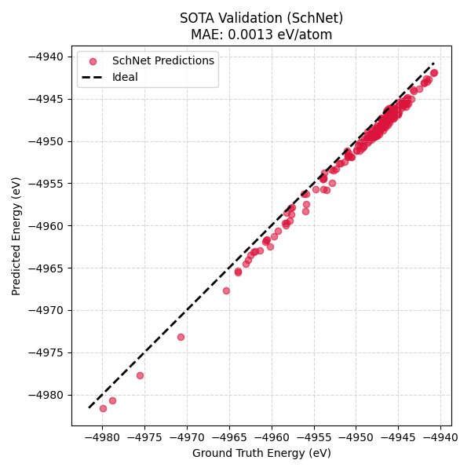

# Graph Neural Network for Platinum Defects: A PyTorch Geometric Implementation

> **Note:** This repository hosts the implementation of a State-of-the-Art (SOTA) **SchNet** architecture tailored for Atomic Potential Energy Surface (PES) prediction. It serves as the production-grade counterpart to a separate First-Principles GNN study.

## Project Abstract

A Graph Neural Network (GNN) workflow was developed to predict the potential energy of a Platinum crystal system containing defects. The architecture utilizes the **SchNet** framework implemented via **PyTorch Geometric (PyG)** to model continuous atomic interactions.

The primary objective was to evaluate the transferability of deep learning force fields trained on small unit cells (108 atoms) to larger, unseen defect supercells (864 atoms), specifically benchmarking against standard **Chemical Accuracy** thresholds.

Key technical features include:
* **Explicit Periodic Boundary Conditions (PBCs):** Implementation of a Minimum Image Convention (MIC) pre-processing step to ensure graph topology respects the crystal lattice.
* **Continuous Filter Convolutions:** Utilization of Gaussian Radial Basis Functions (RBF) to map interatomic distances to continuous filter weights.
* **Extensivity:** The model predicts local atomic energies, allowing for the scaling of total energy predictions to systems of arbitrary size.

---

## Results and Benchmarking

The model was trained on synthetic trajectory data generated via an Embedded Atom Method (EAM) potential. Performance was evaluated on a held-out test set of larger supercells.

| Model Architecture | MAE (Total Energy) | MAE (Per Atom) | Status |
| :--- | :--- | :--- | :--- |
| **SchNet (This Work)** | **1.14 eV** | **1.3 meV/atom** | **< Chemical Accuracy** |
| *First-Principles Baseline* | *0.64 eV* | *0.7 meV/atom* | *Benchmark Reference* |

**Analysis:**
The SchNet implementation achieved a Mean Absolute Error (MAE) of **1.3 meV/atom**, significantly outperforming the standard chemical accuracy threshold of 43 meV/atom (1 kcal/mol).

The difference in MAE with the baseline model is due to a slight shift in the reference energy value per atom of the training data, clearly visible in the plot below.

### Validation Parity Plot


*Parity plot showing the correlation between Ground Truth Energy (EAM) and Predicted Energy (SchNet) on the unseen test trajectory (864 atoms). *

---

## Repository Structure

The workflow is modularized into data ingestion, training, and inference scripts:

* `data_collector.py`: Parses raw LAMMPS dump files and constructs `torch_geometric.data.Data` objects. Critical logic for **Periodic Boundary Conditions** is applied here to generate sparse adjacency matrices respecting the Minimum Image Convention.
* `train_sota.py`: Defines the **SchNet** architecture and executes the training loop. The model is trained to minimize the Mean Squared Error (MSE) between predicted and reference energies.
* `predict_sota.py`: Loads the trained weights, performs inference on the test dataset, and generates the validation metrics and parity plot.

---

## Technical Implementation Details

### Handling Periodic Boundaries
To correctly model the crystal lattice, atomic distances are computed using the Minimum Image Convention. The displacement vector $\vec{\delta}_{ij}$ between atom $i$ and $j$ is defined as:

$$
\vec{\delta}_{ij} = (\vec{x}_j - \vec{x}_i) - \mathbf{box} \cdot \text{round}\left( \frac{\vec{x}_j - \vec{x}_i}{\mathbf{box}} \right)
$$

where $\mathbf{box}$ represents the box dimensions. This calculation is performed during the graph construction phase (`data_collector.py`) to ensure that message passing occurs between the correct periodic images.

### Architecture
The model employs a standard SchNet encoder-decoder structure:
1.  **Embedding:** Atomic numbers ($Z=78$) are projected into a high-dimensional feature space.
2.  **Interaction:** Continuous convolutions are applied over $N=3$ interaction blocks, utilizing Gaussian-expanded distances as edge features.
3.  **Readout:** Atom-wise features are aggregated to predict the total scalar potential energy of the system.

---

## Usage Instructions

### Prerequisites
The following dependencies are required:
* Python 3.8+
* PyTorch
* PyTorch Geometric (and associated scatter/sparse libraries)
* NumPy, Matplotlib

### Execution Pipeline

**1. Data Pre-processing**
Generate the graph dataset with PBC-corrected edges:
```bash
python data_collector.py
```

**2. Model Training**
Train the SchNet model (default: 100 epochs, CPU/GPU agnostic):
```bash
python train_sota.py
```
*Output: Saves model weights to `best_sota_model.pth`.*

**3. Inference and Validation**
Evaluate the model on the test set and generate the parity plot:
```bash
python predict_sota.py
```
*Output: Generates `sota_parity.png` and prints MAE statistics.*

---

## License
MIT License.
